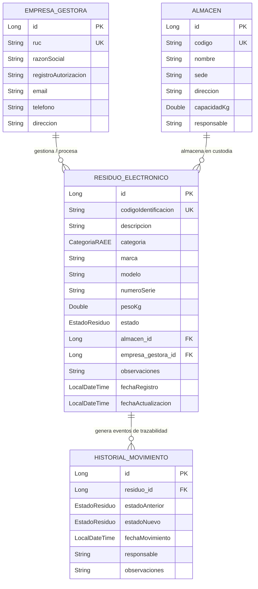

# UNIVERSIDAD TECNOLÓGICA DEL PERÚ (UTP)
## CURSO: DESARROLLO WEB INTEGRADO (100000ST61)
### AVANCE DE PROYECTO FINAL 1 (APF1) – UNIDAD 1: API REST

---

## 1. Definición Inicial del Sistema

### 1.1. Nombre del Proyecto
**EcoTechTrack – Plataforma Web para la Gestión y Trazabilidad Integral de Residuos de Aparatos Eléctricos y Electrónicos (RAEE)**  
*(Tema 4 de TEMAS DETALLE.pdf)*

---

### 1.2. Planteamiento del Problema y Alcance del Sistema en esta Primera Fase

#### Problemática
En la actualidad, las instituciones educativas, empresas públicas y corporaciones privadas renuevan constantemente su parque informático y tecnológico (servidores, computadoras, monitores, switches, baterías y periféricos). Sin embargo, una vez que los equipos son dados de baja técnica u obsolescencia, **no existe una trazabilidad integral ni control automatizado** que registre de forma transparente el flujo del residuo desde su origen hasta su destino final.
Esta falta de control provoca:
- Dispersión de información en hojas de cálculo y notas manuales propensas a errores.
- Riesgo de pérdidas o desvío no autorizado de componentes con metales pesados o sustancias contaminantes (plomo, mercurio, cadmio).
- Incumplimiento de las normativas ambientales peruanas dictadas por el **MINAM (D.S. N° 009-2019-MINAM)** para el régimen especial de gestión y manejo de RAEE.
- Carencia de auditoría sobre qué empresa gestora autorizada recogió los residuos y en qué depósito o almacén se encuentran bajo custodia.

#### Alcance de la Fase 1 (APF1)
En este primer avance se implementó el núcleo backend mediante una **API RESTful desarrollada en Spring Boot 3**:
- **Gestión del inventario de RAEE**: Registro de bajas, clasificación técnica por categorías oficiales (informática, consumo, baterías, etc.), datos técnicos (marca, modelo, serie, peso en kg).
- **Modelo de dominio relacional**: Vinculación estricta de los residuos con sus **Almacenes de Custodia Temporal** y las **Empresas Gestoras RAEE (EO-RS)** autorizadas.
- **Cadena de Trazabilidad y Auditoría**: Registro cronológico de cambios de estado (`DECLARADO_BAJA` ➔ `ALMACENADO_TEMPORAL` ➔ `SOLICITUD_RECOJO` ➔ `EN_TRANSITO` ➔ `RECEPCION_GESTOR` ➔ `EN_VALORIZACION` ➔ `DISPOSICION_FINAL`) mediante la entidad de auditoría `HistorialMovimiento`.
- **Desarrollo Guiado por Pruebas (TDD)**: Cobertura con pruebas unitarias y de integración usando JUnit 5, Mockito y MockMvc.

---

### 1.3. Justificación de la Elección del Problema
1. **Relevancia Ambiental y Legal**: En el Perú, las leyes ambientales exigen a los generadores de RAEE asegurar que los aparatos en desuso sean entregados exclusivamente a Empresas Operadoras de Residuos Sólidos (EO-RS) registradas ante el MINAM.
2. **Impacto Operativo Real**: Permite a las áreas de TI y Almacén tener una visión consolidada en tiempo real de los kilos de chatarra electrónica acumulados y su ubicación física.
3. **Idoneidad para el curso**: El ciclo de vida de los residuos electrónicos involucra múltiples entidades con relaciones de cardinalidad directa (1 a N, N a 1), cambios de estado transaccionales y necesidad de endpoints REST bien estructurados.

---

### 1.4. Usuarios del Sistema (Roles Esperados)

| Rol | Responsabilidades |
| :--- | :--- |
| **Administrador Ambiental / Jefe de TI** | Declara formalmente la baja de los activos, autoriza el descarte y asigna las solicitudes de recojo a operadores RAEE. |
| **Encargado de Almacén / Custodio** | Registra el ingreso del residuo al almacén temporal, verifica peso en balanza y entrega el lote al transportista. |
| **Operador / Conductor de Empresa Gestora** | Recoge el residuo con guía de remisión autorizada, actualiza el estado a `EN_TRANSITO` y certifica la recepción en planta. |
| **Auditor / Supervisor Ambiental** | Consulta el historial inmutable de trazabilidad, exporta reportes y fiscaliza el cumplimiento normativo. |

---

### 1.5. Diagrama de Entidades del Modelo de Dominio

#### Diagrama Entidad-Relación (ER)



---

## 2. Estructura Base del Proyecto Spring Boot

### 2.1. Generación y Configuración del Entorno
- **Framework base**: Spring Boot 3.3.4
- **Versión de Java**: Java 17 / 21
- **Herramienta de Construcción**: Apache Maven 3.9
- **Dependencias Principales**:
  - `spring-boot-starter-web`: Creación de servicios RESTful y servidor embebido Apache Tomcat.
  - `spring-boot-starter-data-jpa`: Capa de persistencia con Hibernate ORM y Spring Data.
  - `spring-boot-starter-validation`: Validaciones declarativas mediante Jakarta Bean Validation (`@NotNull`, `@NotBlank`, `@Size`, `@Positive`).
  - `com.h2database:h2`: Motor relacional SQL en memoria para desarrollo ágil y ejecución de pruebas sin dependencias externas.
  - `org.projectlombok:lombok`: Reducción de código repetitivo (Getters, Setters, Builders, Constructores).
  - `spring-boot-starter-test`: Suite de pruebas unitarias y de integración con JUnit 5, Mockito y Spring MockMvc.
  - `spring-boot-devtools`: Recarga rápida en caliente para el entorno de desarrollo.

---

### 2.2. Organización del Código en Paquetes

El proyecto sigue una estricta **arquitectura en capas desacoplada** con **inyección de dependencias por constructor**:

```text
com.utp.ecotechtrack/
├── EcoTechTrackApplication.java       # Clase principal con anotación @SpringBootApplication
├── config/
│   └── DataInitializer.java          # Semillero con CommandLineRunner para carga de datos iniciales
├── controller/
│   ├── AlmacenController.java        # Endpoints REST para Almacenes
│   ├── EmpresaGestoraController.java # Endpoints REST para Empresas Gestoras
│   └── ResiduoController.java        # Endpoints REST para Residuos y Trazabilidad
├── dto/
│   ├── AlmacenDTO.java               # DTO con validaciones para Almacén
│   ├── CambioEstadoDTO.java          # DTO para eventos de cambio de estado
│   ├── EmpresaGestoraDTO.java        # DTO con validaciones para Operador RAEE
│   ├── ErrorResponseDTO.java         # DTO estandarizado para respuestas de error HTTP
│   ├── HistorialMovimientoDTO.java   # DTO de respuesta para eventos de auditoría
│   ├── ResiduoRequestDTO.java        # DTO de entrada para creación y actualización
│   └── ResiduoResponseDTO.java       # DTO de salida con objetos relacionales anidados
├── exception/
│   ├── BadRequestException.java      # Excepción personalizada HTTP 400
│   ├── GlobalExceptionHandler.java   # @RestControllerAdvice centralizado
│   └── ResourceNotFoundException.java# Excepción personalizada HTTP 404
├── model/
│   ├── Almacen.java                  # @Entity: Punto de almacenamiento temporal
│   ├── CategoriaRAEE.java            # Enum: Clasificación técnica de RAEE
│   ├── EmpresaGestora.java           # @Entity: Empresa Operadora autorizada
│   ├── EstadoResiduo.java            # Enum: Estados del ciclo de vida RAEE
│   ├── HistorialMovimiento.java      # @Entity: Registro de auditoría/trazabilidad
│   └── ResiduoElectronico.java       # @Entity: Entidad principal de residuo
├── repository/
│   ├── AlmacenRepository.java        # Spring Data JPA Repository para Almacen
│   ├── EmpresaGestoraRepository.java # Spring Data JPA Repository para EmpresaGestora
│   ├── HistorialMovimientoRepository.java # Spring Data JPA para Historial
│   └── ResiduoRepository.java        # Spring Data JPA para ResiduoElectronico
└── service/
    ├── AlmacenService.java           # Interfaz de lógica de negocio de Almacenes
    ├── EmpresaGestoraService.java    # Interfaz de Empresas Gestoras
    ├── ResiduoService.java           # Interfaz de Residuos y Trazabilidad
    └── impl/
        ├── AlmacenServiceImpl.java
        ├── EmpresaGestoraServiceImpl.java
        └── ResiduoServiceImpl.java
```

---

## 3. Modelo de Dominio y Relaciones JPA

### 3.1. Clases Java anotadas con `@Entity` y sus Relaciones

#### 1. Entidad `ResiduoElectronico`
- **Anotación**: `@Entity @Table(name = "residuos_electronicos")`
- **Atributos representativos**: `id`, `codigoIdentificacion` (UK), `descripcion`, `categoria` (Enum), `marca`, `modelo`, `numeroSerie`, `pesoKg`, `estado` (Enum), `observaciones`, `fechaRegistro`, `fechaActualizacion`.
- **Relaciones implementadas**:
  - `@ManyToOne(fetch = FetchType.LAZY) @JoinColumn(name = "almacen_id") private Almacen almacen;`
  - `@ManyToOne(fetch = FetchType.LAZY) @JoinColumn(name = "empresa_gestora_id") private EmpresaGestora empresaGestora;`
  - `@OneToMany(mappedBy = "residuo", cascade = CascadeType.ALL, orphanRemoval = true) private List<HistorialMovimiento> historialMovimientos;`

#### 2. Entidad `EmpresaGestora`
- **Anotación**: `@Entity @Table(name = "empresas_gestoras")`
- **Atributos representativos**: `id`, `ruc` (UK de 11 dígitos), `razonSocial`, `registroAutorizacion` (MINAM), `email`, `telefono`, `direccion`.
- **Relaciones implementadas**:
  - `@OneToMany(mappedBy = "empresaGestora") private List<ResiduoElectronico> residuos;`

#### 3. Entidad `Almacen`
- **Anotación**: `@Entity @Table(name = "almacenes")`
- **Atributos representativos**: `id`, `codigo` (UK), `nombre`, `sede`, `direccion`, `capacidadKg`, `responsable`.
- **Relaciones implementadas**:
  - `@OneToMany(mappedBy = "almacen") private List<ResiduoElectronico> residuos;`

#### 4. Entidad `HistorialMovimiento`
- **Anotación**: `@Entity @Table(name = "historial_movimientos")`
- **Atributos representativos**: `id`, `estadoAnterior`, `estadoNuevo`, `fechaMovimiento`, `responsable`, `observaciones`.
- **Relaciones implementadas**:
  - `@ManyToOne(fetch = FetchType.LAZY) @JoinColumn(name = "residuo_id", nullable = false) private ResiduoElectronico residuo;`

---

## 4. Catálogo de Endpoints RESTful

| Módulo | Método | Endpoint | Descripción | Código HTTP |
| :--- | :---: | :--- | :--- | :---: |
| **Residuos** | `GET` | `/api/residuos` | Listar todos los residuos (filtros por `estado` y `categoria`) | `200 OK` |
| **Residuos** | `GET` | `/api/residuos/{id}` | Obtener residuo por ID | `200 OK` / `404 Not Found` |
| **Residuos** | `GET` | `/api/residuos/codigo/{codigo}` | Obtener residuo por código único RAEE | `200 OK` / `404 Not Found` |
| **Residuos** | `GET` | `/api/residuos/{id}/historial` | Consultar la línea de tiempo de trazabilidad | `200 OK` / `404 Not Found` |
| **Residuos** | `POST` | `/api/residuos` | Declarar baja y asociar a almacén/empresa | `201 Created` / `400 Bad Request` |
| **Residuos** | `PUT` | `/api/residuos/{id}` | Actualizar datos completos del residuo | `200 OK` / `400` / `404` |
| **Residuos** | `PATCH`| `/api/residuos/{id}/estado` | Transicionar fase de ciclo de vida con historial | `200 OK` / `404 Not Found` |
| **Residuos** | `DELETE`| `/api/residuos/{id}` | Eliminar residuo del sistema | `204 No Content` / `404` |
| **Empresas** | `GET` | `/api/empresas-gestoras` | Listar empresas gestoras autorizadas | `200 OK` |
| **Empresas** | `GET` | `/api/empresas-gestoras/{id}` | Obtener empresa por ID | `200 OK` / `404 Not Found` |
| **Empresas** | `POST` | `/api/empresas-gestoras` | Registrar nueva empresa operadora RAEE | `201 Created` / `400 Bad Request` |
| **Empresas** | `PUT` | `/api/empresas-gestoras/{id}` | Actualizar datos de empresa gestora | `200 OK` / `400` / `404` |
| **Empresas** | `DELETE`| `/api/empresas-gestoras/{id}`| Eliminar empresa gestora | `204 No Content` / `404` |
| **Almacenes**| `GET` | `/api/almacenes` | Listar almacenes y puntos de custodia | `200 OK` |
| **Almacenes**| `GET` | `/api/almacenes/{id}` | Obtener almacén por ID | `200 OK` / `404 Not Found` |
| **Almacenes**| `POST` | `/api/almacenes` | Registrar nuevo almacén de acopio | `201 Created` / `400 Bad Request` |
| **Almacenes**| `PUT` | `/api/almacenes/{id}` | Actualizar datos del almacén | `200 OK` / `400` / `404` |
| **Almacenes**| `DELETE`| `/api/almacenes/{id}` | Eliminar almacén | `204 No Content` / `404` |

---

## 5. Pruebas Unitarias Automatizadas (TDD)

El proyecto cuenta con **11 pruebas unitarias automatizadas** usando `@WebMvcTest`, `MockMvc` y `Mockito`:
- `ResiduoControllerTest`: 7 pruebas (Listado, búsqueda por ID, búsqueda 404, creación 201, validaciones 400, cambio de estado, eliminación 204).
- `EmpresaGestoraControllerTest`: 2 pruebas (Listado con HTTP 200, registro con HTTP 201).
- `AlmacenControllerTest`: 2 pruebas (Listado con HTTP 200, registro con HTTP 201).

**Resultado de ejecución de Maven (`mvn test`):**
```text
[INFO] Results:
[INFO] Tests run: 11, Failures: 0, Errors: 0, Skipped: 0
[INFO] BUILD SUCCESS
```
