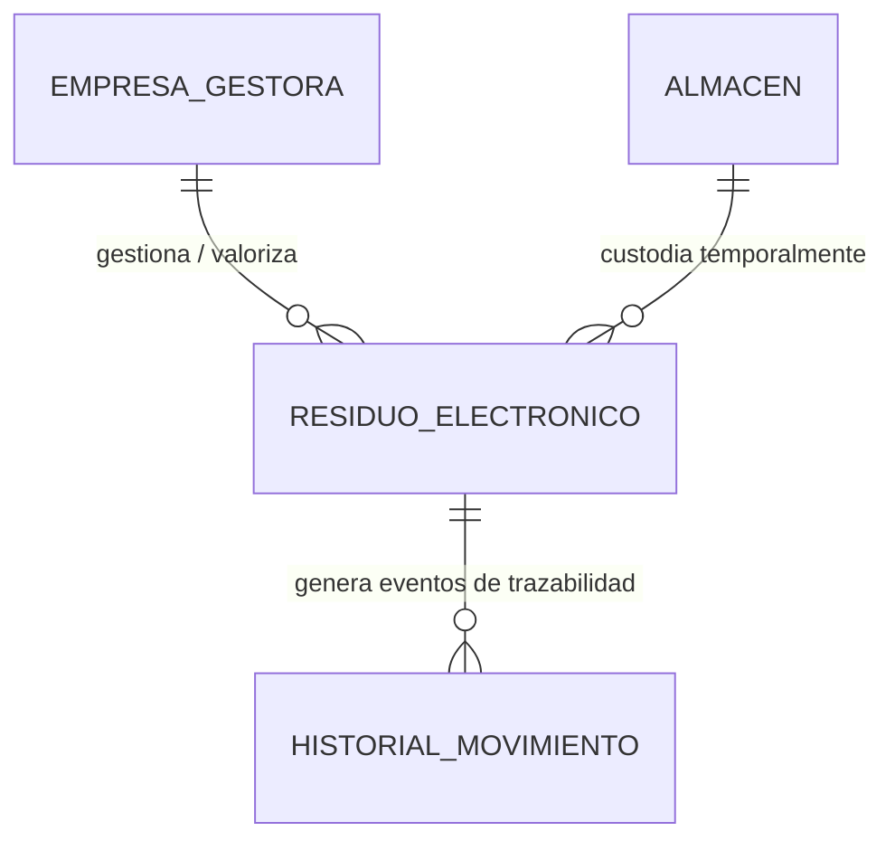

# EcoTechTrack – Plataforma Web para Trazabilidad de RAEE

**Avance de Proyecto Final 1 (APF1) - Desarrollo Web Integrado (100000ST61) - UTP**  
*Tema 4: Sistema de Gestión de Residuos de Aparatos Eléctricos y Electrónicos*

---

## 📌 Descripción General
**EcoTechTrack** es una plataforma web desarrollada con **Spring Boot 3** que resuelve la problemática de trazabilidad de los **Residuos de Aparatos Eléctricos y Electrónicos (RAEE)** desde que son declarados obsoletos o dados de baja técnica en una institución o empresa, pasando por su custodia en almacenes temporales, hasta su recojo, transporte y entrega a **Empresas Gestoras (EO-RS)** autorizadas por el MINAM para su valorización o disposición final ecológica.

---

## 🚀 Arquitectura y Tecnologías
- **Java**: 17 / 21
- **Framework**: Spring Boot 3.3.4
  - `spring-boot-starter-web`: API RESTful y servidor embebido Tomcat.
  - `spring-boot-starter-data-jpa`: Persistencia con Hibernate ORM y Spring Data.
  - `spring-boot-starter-validation`: Validaciones declarativas Jakarta Validation.
  - `spring-boot-starter-test`: Pruebas unitarias automatizadas con JUnit 5, MockMvc y Mockito.
  - `spring-boot-devtools`: Herramientas de desarrollo.
  - `lombok`: Optimización de código con anotaciones `@Data`, `@Builder`, `@NoArgsConstructor`, `@AllArgsConstructor`.
- **Base de Datos**: H2 en memoria (`jdbc:h2:mem:ecotechtrackdb`)
  - Consola Web: [http://localhost:8080/h2-console](http://localhost:8080/h2-console) (JDBC URL: `jdbc:h2:mem:ecotechtrackdb`, User: `sa`, Password: vacía)
- **Patrón Arquitectónico**: En capas (Controller ➔ Service ➔ Repository ➔ Model/Database) con **Inyección de Dependencias por Constructor**.

---

## 🏛️ Modelo de Dominio y Relaciones JPA



1. **`ResiduoElectronico`**: Entidad principal que describe el equipo informático o electrónico dado de baja.
   - `@ManyToOne` ➔ `Almacen`: Ubicación de almacenamiento o depósito físico del residuo.
   - `@ManyToOne` ➔ `EmpresaGestora`: Operador RAEE formal autorizado por MINAM para el recojo y disposición.
   - `@OneToMany` ➔ `HistorialMovimiento`: Registro de auditoría de cada cambio de fase.
2. **`EmpresaGestora`**: Empresas operadoras de residuos sólidos (RUC, razón social, registro MINAM, contacto).
3. **`Almacen`**: Puntos de acopio temporal dentro de las sedes institucionales (código, nombre, sede, capacidad en kg).
4. **`HistorialMovimiento`**: Historial de trazabilidad que registra fechas, estado anterior, estado nuevo y responsable del movimiento.

---

## 📂 Estructura del Código Fuente
```text
src/main/java/com/utp/ecotechtrack/
├── EcoTechTrackApplication.java           # Clase principal Spring Boot
├── config/
│   └── DataInitializer.java              # Semillero de datos iniciales con relaciones
├── controller/
│   ├── AlmacenController.java            # Endpoints REST para Almacenes
│   ├── EmpresaGestoraController.java     # Endpoints REST para Empresas Gestoras
│   └── ResiduoController.java            # Endpoints REST para Residuos y Trazabilidad
├── dto/
│   ├── AlmacenDTO.java                   # DTO para Almacén
│   ├── CambioEstadoDTO.java              # DTO para transiciones de estado
│   ├── EmpresaGestoraDTO.java            # DTO para Operador RAEE
│   ├── ErrorResponseDTO.java             # DTO de respuesta estándar de error
│   ├── HistorialMovimientoDTO.java       # DTO para eventos de auditoría
│   ├── ResiduoRequestDTO.java            # DTO de entrada con validaciones
│   └── ResiduoResponseDTO.java           # DTO de salida con datos relacionales
├── exception/
│   ├── BadRequestException.java          # HTTP 400 personalizado
│   ├── GlobalExceptionHandler.java       # Manejador centralizado (@RestControllerAdvice)
│   └── ResourceNotFoundException.java   # HTTP 404 personalizado
├── model/
│   ├── Almacen.java                      # @Entity Almacén
│   ├── CategoriaRAEE.java                # Enum Clasificación RAEE
│   ├── EmpresaGestora.java               # @Entity Empresa Operadora RAEE
│   ├── EstadoResiduo.java                # Enum Ciclo de vida
│   ├── HistorialMovimiento.java          # @Entity Historial de Trazabilidad
│   └── ResiduoElectronico.java           # @Entity Residuo Electrónico
├── repository/
│   ├── AlmacenRepository.java            # Spring Data JPA Repository
│   ├── EmpresaGestoraRepository.java     # Spring Data JPA Repository
│   ├── HistorialMovimientoRepository.java# Spring Data JPA Repository
│   └── ResiduoRepository.java            # Spring Data JPA Repository
└── service/
    ├── AlmacenService.java               # Interfaz de negocio Almacenes
    ├── EmpresaGestoraService.java        # Interfaz de negocio Empresas Gestoras
    ├── ResiduoService.java               # Interfaz de negocio Residuos y Trazabilidad
    └── impl/
        ├── AlmacenServiceImpl.java
        ├── EmpresaGestoraServiceImpl.java
        └── ResiduoServiceImpl.java
```

---

## 🌐 Endpoints RESTful Implementados

### 1. Residuos Electrónicos
- `GET /api/residuos`: Listar todos los residuos (filtros opcionales `?estado=` y `?categoria=`).
- `GET /api/residuos/{id}`: Obtener detalle completo de un residuo por ID.
- `GET /api/residuos/codigo/{codigo}`: Consultar por código único de identificación RAEE.
- `GET /api/residuos/{id}/historial`: Consultar la línea de tiempo de trazabilidad y movimientos.
- `POST /api/residuos`: Registrar y declarar baja de residuo vinculándolo a almacén y empresa gestora.
- `PUT /api/residuos/{id}`: Actualizar los datos del residuo.
- `PATCH /api/residuos/{id}/estado`: Avanzar de estado en la cadena de trazabilidad.
- `DELETE /api/residuos/{id}`: Eliminar residuo del sistema.

### 2. Empresas Gestoras RAEE
- `GET /api/empresas-gestoras`: Listar empresas operadoras autorizadas.
- `GET /api/empresas-gestoras/{id}`: Obtener empresa gestora por ID.
- `POST /api/empresas-gestoras`: Registrar nueva empresa operadora.
- `PUT /api/empresas-gestoras/{id}`: Actualizar empresa gestora.
- `DELETE /api/empresas-gestoras/{id}`: Eliminar empresa gestora.

### 3. Almacenes y Custodia Temporal
- `GET /api/almacenes`: Listar almacenes registrados.
- `GET /api/almacenes/{id}`: Obtener almacén por ID.
- `POST /api/almacenes`: Registrar nuevo almacén.
- `PUT /api/almacenes/{id}`: Actualizar almacén.
- `DELETE /api/almacenes/{id}`: Eliminar almacén.

---

## 🧪 Pruebas Unitarias Automatizadas (TDD)
El proyecto cuenta con **11 pruebas unitarias** que evalúan los controladores, códigos de estado HTTP y validaciones:
- `ResiduoControllerTest.java` (7 pruebas)
- `EmpresaGestoraControllerTest.java` (2 pruebas)
- `AlmacenControllerTest.java` (2 pruebas)

Para ejecutar las pruebas:
```bash
mvn test
```
*Resultado: `Tests run: 11, Failures: 0, Errors: 0, BUILD SUCCESS`.*

---

## 📮 Colección de Postman
Importa en Postman el archivo:
`ecotechtrack_postman_collection.json`
Incluye todas las peticiones listas para pruebas manuales y evidencias del reporte.
